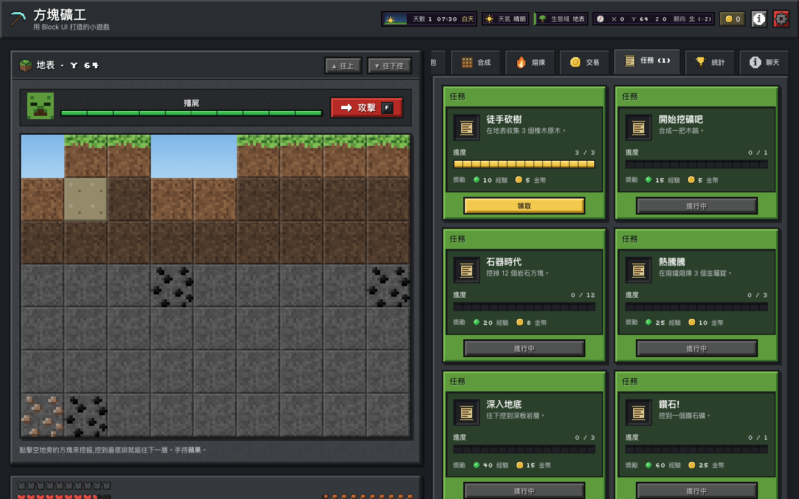

<h1>Block UI</h1>

<p align="right">
  English | <a href="./README.zh-TW.md">繁體中文</a>
</p>

<p align="center">
  
</p>

<p align="center">Block × pixel × crafting game-style component library, built for React and TypeScript</p>

<p align="center">
  <a href="https://github.com/malilion/BlockUI/actions/workflows/ci.yml"></a>
  <a href="https://github.com/malilion/BlockUI/actions/workflows/docs.yml"></a>
  <a href="https://github.com/malilion/BlockUI/stargazers"></a>
  <a href="https://www.npmjs.com/package/@malilion/block-ui-react"></a>
  <a href="./LICENSE"></a>
  <br/>
  
  
  
  
</p>

<p align="center">
  <a href="https://malilion.github.io/BlockUI/"><b>📖 Docs & live demos (Storybook)</b></a>
  ·
  <a href="https://malilion.github.io/BlockUI/game/"><b>🎮 Play Block Miner</b></a>
</p>

<p align="center">
  
</p>

Block UI is a React component library whose visual language comes from block-building survival games: **Block, Inventory, Craft, Game HUD and Pixel Interaction**. It is not "a normal SaaS dashboard with a pixel font" — every main interaction is a block. Buttons are bevelled blocks that snap up on hover and press down on click, inventories are real keyboard-navigable grids of slots, health is drawn in hearts, and the crafting table turns a grid into a result.

All artwork — the 50+ pixel icons, the procedural stone / dirt / planks textures and the landscape previews — is original. No third-party game textures, logos or characters are bundled.

The early concept mockup in [`docs/design/concept.png`](./docs/design/concept.png) is a design reference only: it is not part of any npm package, and its game-style character and scenery are not Block UI assets.

## Features

- 50+ components across actions, forms, inventory, crafting, HUD, cards, feedback, navigation and layout
- Written in TypeScript with strict types; every component forwards refs and accepts `className` and native attributes
- Signature game UI: `InventoryGrid`, `InventorySlot`, `ItemStack`, `ItemTooltip`, `Hotbar`, `CraftingTable`, `Furnace`, `QuestCard`, `AchievementCard`, `PlayerHUD`
- 5 themes — **Grassland**, **Cave**, **Deepslate**, **Nether**, **End** — switched with one `data-theme` attribute; every component follows without changes
- Design tokens as TypeScript objects and CSS variables (`--block-*`); components never hard-code colors
- `@malilion/block-ui-icons`: 50+ original 16 × 16 pixel-art SVG icons, tree-shakable
- Accessible: WCAG 2.2 AA — axe runs on every story in all five themes and on the playground in CI, ARIA grid / tabs / dialog patterns, focus trapping, visible focus rings and `prefers-reduced-motion`
- Snappy, mechanical motion: nothing slower than 160 ms, `steps()` easing, no springs or blur
- Responsive: the sidebar collapses on tablet and turns into a hotbar at the bottom on mobile
- ESM, tree-shakable (`preserveModules`), one CSS file, React as the only peer dependency

## Installation

```bash
pnpm add @malilion/block-ui-react
```

```bash
npm install @malilion/block-ui-react
```

```bash
yarn add @malilion/block-ui-react
```

`@malilion/block-ui-react` installs `@malilion/block-ui-tokens`, `@malilion/block-ui-themes` and `@malilion/block-ui-icons` for you. It supports React 18.2 and 19.

> [!NOTE]
> Published on npm: [`@malilion/block-ui-react`](https://www.npmjs.com/package/@malilion/block-ui-react), [`-tokens`](https://www.npmjs.com/package/@malilion/block-ui-tokens), [`-themes`](https://www.npmjs.com/package/@malilion/block-ui-themes) and [`-icons`](https://www.npmjs.com/package/@malilion/block-ui-icons). Releases are documented in [docs/RELEASING.md](./docs/RELEASING.md).

## Quick Start

```tsx
// main.tsx
import "@malilion/block-ui-react/styles.css";
import { createRoot } from "react-dom/client";
import { BlockUIProvider } from "@malilion/block-ui-react";
import App from "./App";

createRoot(document.getElementById("root")!).render(
  <BlockUIProvider theme="deepslate">
    <App />
  </BlockUIProvider>,
);
```

```tsx
// App.tsx
import {
  BlockButton,
  InventoryGrid,
  InventorySlot,
  ItemStack,
  QuestCard,
} from "@malilion/block-ui-react";
import { DiamondIcon } from "@malilion/block-ui-icons";

export default function App() {
  return (
    <>
      <InventoryGrid columns={9} rows={3}>
        <InventorySlot>
          <ItemStack icon={<DiamondIcon />} amount={12} maxAmount={64} name="Diamond" />
        </InventorySlot>
      </InventoryGrid>

      <QuestCard
        title="Find Diamonds"
        description="Mine 10 diamonds."
        progress={7}
        max={10}
        xp={120}
        coins={500}
      />

      <BlockButton variant="grass">Start</BlockButton>
    </>
  );
}
```

Always import from the package root — never from internal paths:

```tsx
import { BlockButton, InventoryGrid } from "@malilion/block-ui-react"; // ✅
```

Show toasts from anywhere. `<BlockUIProvider>` already renders the toast region:

```ts
import { toast } from "@malilion/block-ui-react";

toast.success("World saved.");
toast.info("Update available.");
toast.warning("Low hunger.");
toast.error("Connection failed.", { duration: 0 }); // stays until closed
```

Load the pixel font for the full block look (components fall back to a monospace font without it):

```bash
pnpm add @fontsource/silkscreen
```

```ts
import "@fontsource/silkscreen/400.css";
import "@fontsource/silkscreen/700.css";
```

## Gallery

| Inventory, hotbar & chest                                     | Crafting table & furnace                                |
| ------------------------------------------------------------- | ------------------------------------------------------- |
|        |    |
| **Quest, achievement, player, server & world cards**          | **Alerts, toasts, modal & loading**                     |
|                |    |
| **Nether theme**                                              | **End theme**                                           |
|  |  |

<p align="center">
  <br>
  <sub>Mobile: the sidebar becomes a bottom hotbar.</sub>
</p>

Every component has stories in [Storybook](https://malilion.github.io/BlockUI/) (or run `pnpm storybook` locally) — always `Default`, `Variants`, `States`, `Sizes`, `Disabled`, `Interactive` (an interaction test) and `Responsive` — with live controls, all variants and states, usage, props tables, accessibility notes and an a11y checker. Storybook also has Foundations pages (colors, typography, spacing, shadows, themes, icons) and full-screen Patterns (dashboard, player profile, inventory screen, crafting screen, server browser).

## Demo game

**[Block Miner](https://malilion.github.io/BlockUI/game/)** ([`apps/game`](./apps/game)) is a small mining and crafting game built only from the published npm packages, in Traditional Chinese through `zhTWMessages`. Dig through five layers that switch the theme, craft tools in `RecipeBook`, smelt ore in `Furnace`, trade with `TradingUI`, fight monsters shown in a `BossBar`, and track progress with `QuestCard`, `AchievementCard` and `Scoreboard`. Progress is saved in the browser. Run it locally with `pnpm game`.

<p align="center">
  
</p>

## Components

| Category   | Components                                                                                                                                                                             |
| ---------- | -------------------------------------------------------------------------------------------------------------------------------------------------------------------------------------- |
| Actions    | `BlockButton` · `IconButton` · `BlockMenu` · `ContextMenu`                                                                                                                             |
| Forms      | `BlockInput` · `BlockTextarea` · `BlockSelect` · `BlockCheckbox` · `BlockRadioGroup` / `BlockRadio` · `BlockToggle` · `BlockSlider` · `NumberInput`                                    |
| Inventory  | `Inventory` / `InventorySection` · `InventoryGrid` · `InventorySlot` · `ItemStack` · `ItemTooltip` · `DurabilityBar` · `Hotbar`                                                        |
| Crafting   | `CraftingTable` · `CraftingGrid` · `CraftingSlot` · `CraftingResult` · `Furnace` · `EnchantingTable` · `BrewingStand` · `Anvil` · `TradingUI` · `RecipeBook`                           |
| HUD        | `HealthBar` · `ArmorBar` · `HungerBar` · `XPBar` · `PlayerHUD` · `BossBar` · `Scoreboard` · `CoordinatesHUD` · `BiomeIndicator` · `DayNightIndicator` · `WeatherIndicator` · `MiniMap` |
| Cards      | `BlockCard` · `QuestCard` · `AchievementCard` · `PlayerCard` · `ServerCard` · `WorldCard` · `ServerBrowser` · `WorldBrowser`                                                           |
| Display    | `BlockTable` · `SkillTree` · `Avatar` · `Popover` · `Kbd`                                                                                                                              |
| Feedback   | `BlockAlert` · `toast()` / `BlockToaster` · `BlockModal` · `ConfirmDialog` · `BlockProgress` · `BlockLoading` · `BlockBadge` · `BlockTooltip` · `Drawer` · `EmptyState` · `Skeleton`   |
| Navigation | `BlockSidebar` / `SidebarItem` · `BlockTabs` · `Breadcrumb` · `HotbarNavigation` · `BlockPagination` · `BlockStepper`                                                                  |
| Layout     | `BlockUIProvider` · `BlockPanel` · `BlockStack` · `BlockDivider` · `Accordion` · `BlockGrid` · `BlockContainer`                                                                        |
| Social     | `ChatWindow` · `CommandConsole`                                                                                                                                                        |
| Hooks      | `useControllableState` · `useFocusTrap` · `useDigitHotkeys` · `useMediaQuery` · `useToasts` · `useBlockUI`                                                                             |

## Component Props

Every component accepts the usual attributes (`className`, `aria-*`, `data-*`, event handlers) and forwards its ref. A few of the most used props:

| Component       | Prop                      | Type                                                                                                     | Default       | Description                                                    |
| --------------- | ------------------------- | -------------------------------------------------------------------------------------------------------- | ------------- | -------------------------------------------------------------- |
| BlockButton     | variant                   | `'grass' \| 'stone' \| 'dirt' \| 'wood' \| 'diamond' \| 'emerald' \| 'gold' \| 'redstone' \| 'obsidian'` | `'stone'`     | Block material                                                 |
| BlockButton     | loading                   | `boolean`                                                                                                | `false`       | Pixel loader, `aria-busy`, blocks repeated clicks              |
| InventoryGrid   | columns / rows            | `number`                                                                                                 | `9` / —       | Grid size; `rows` pads with empty slots                        |
| InventoryGrid   | selectedIndex             | `number \| null`                                                                                         | —             | Controlled selection, with `onSelectedIndexChange`             |
| InventorySlot   | rarity                    | `'common' \| 'uncommon' \| 'rare' \| 'epic' \| 'legendary'`                                              | —             | Rarity glow                                                    |
| InventorySlot   | tooltip                   | `ReactNode`                                                                                              | —             | Shown on hover **and** keyboard focus, closes with `Escape`    |
| ItemStack       | icon / amount / maxAmount | `ReactNode` / `number` / `number`                                                                        | —             | Amount shown bottom-right; full stacks highlighted             |
| Hotbar          | hotkeys                   | `boolean`                                                                                                | `true`        | Number keys `1`–`9` select a slot (ignored while typing)       |
| CraftingGrid    | size                      | `2 \| 3`                                                                                                 | `3`           | 2 × 2 or 3 × 3                                                 |
| Furnace         | progress / burning        | `number` / `boolean`                                                                                     | `0` / `false` | State is derived: idle, burning, processing, complete, no fuel |
| HealthBar       | value / max               | `number`                                                                                                 | — / `20`      | Two points per heart, half hearts supported                    |
| BlockProgress   | variant                   | `'grass' \| 'water' \| 'diamond' \| 'emerald' \| 'gold' \| 'redstone'`                                   | `'grass'`     | Omit `value` for an indeterminate bar                          |
| BlockUIProvider | theme                     | `'grassland' \| 'cave' \| 'deepslate' \| 'nether' \| 'end'`                                              | `'grassland'` | Applies `data-theme` to its subtree                            |

Full API tables are generated in Storybook. Types are exported too:

```ts
import type {
  BlockButtonVariant,
  ItemRarity,
  PlayerStats,
  ToastOptions,
} from "@malilion/block-ui-react";
```

## Keyboard

| Component                    | Keys                                                                                                                                  |
| ---------------------------- | ------------------------------------------------------------------------------------------------------------------------------------- |
| InventoryGrid / CraftingGrid | `←` `↑` `→` `↓` move · `Home` / `End` row start / end (`Ctrl` for the whole grid) · `Enter` / `Space` select · `Escape` close tooltip |
| Hotbar                       | `1`–`9` select a slot from anywhere · `←` `→` move and wrap                                                                           |
| BlockModal / ConfirmDialog   | `Tab` / `Shift+Tab` cycle inside · `Escape` close · focus returns to the trigger                                                      |
| BlockTabs                    | `←` `→` move and activate (wrapping) · `Home` / `End`                                                                                 |
| Toast                        | `Escape` dismisses the focused toast; hover or focus pauses auto-close                                                                |

## Themes

Wrap your app (or one section) in `BlockUIProvider`. Overlays such as modals and toasts render inside the provider, so they follow its theme.

```tsx
<BlockUIProvider theme="nether">
  <App />
</BlockUIProvider>
```

Not using the provider? Set `data-theme` on any ancestor:

```html
<body data-theme="deepslate" class="block-ui-root">
  …
</body>
```

| Theme       | Surface         | Primary      | Feel                       |
| ----------- | --------------- | ------------ | -------------------------- |
| `grassland` | Stone gray      | Grass green  | Default, daylight survival |
| `cave`      | Dark stone      | Torch gold   | Underground                |
| `deepslate` | Deepslate black | Diamond cyan | Deep and cool              |
| `nether`    | Netherrack red  | Lava orange  | Hot                        |
| `end`       | Obsidian purple | Amethyst     | Otherworldly               |

Each theme defines the `BlockTheme` roles (`background`, `surface`, `surfaceAlt`, `primary`, `secondary`, `border`, `text`, `textMuted`, …) as `--block-*` CSS variables. Tests check that text on every surface of every theme reaches WCAG AA.

## Localization

Every built-in string — button labels, empty states, accessible names, status texts — comes from `BlockUIProvider`'s `messages`. English is the default; Block UI ships Traditional Chinese as `zhTWMessages`.

```tsx
import { BlockUIProvider, zhTWMessages } from "@malilion/block-ui-react";

<BlockUIProvider messages={zhTWMessages}>
  <App />
</BlockUIProvider>;
```

Override a few strings by passing only those sections — they are merged onto English:

```tsx
<BlockUIProvider messages={{ questCard: { claim: "Collect" } }}>…</BlockUIProvider>
```

Write a full locale by typing it as `BlockUIMessages`; strings with values (e.g. `worldCard.day`) are functions so each language controls word order. Props such as `label`, `placeholder` or `statusLabels` still override the provider. `useBlockUIMessages()` returns the active messages for your own components. In [Storybook](https://malilion.github.io/BlockUI/), the **Language** toolbar button switches every story, and **Foundations → Localization** shows English and 繁體中文 side by side.

## Palette

| Name      | Token               | Value     | Usage                         |
| --------- | ------------------- | --------- | ----------------------------- |
| Grass     | `--block-grass`     | `#5d9b3d` | Primary, success buttons      |
| Dirt      | `--block-dirt`      | `#79553a` | Secondary blocks              |
| Wood      | `--block-wood`      | `#8a5a2b` | Chests, cards                 |
| Stone     | `--block-stone`     | `#737373` | Default buttons, panels       |
| Deepslate | `--block-deepslate` | `#292929` | Dark surfaces                 |
| Diamond   | `--block-diamond`   | `#52d9d0` | Rare items, highlights        |
| Emerald   | `--block-emerald`   | `#35b84b` | Success, XP                   |
| Gold      | `--block-gold`      | `#f2c94c` | Warnings, rewards, focus ring |
| Redstone  | `--block-redstone`  | `#b52a24` | Danger, errors                |
| Obsidian  | `--block-obsidian`  | `#251b31` | End theme, special actions    |

Every material also has `-light`, `-dark` and an `--block-on-*` text color that is guaranteed to reach 4.5:1 contrast. Components pick a material with `data-material="…"` and read `--block-mat`, `--block-mat-light`, `--block-mat-dark` and `--block-mat-on`.

Only need the tokens?

```ts
import "@malilion/block-ui-tokens/tokens.css";
import { colors, spacing, motion } from "@malilion/block-ui-tokens";
```

## Design Principles

Block UI follows five rules. Respect them when adding new components.

1. **Block first**: squares, rectangles, blocks and grids. No pills, large rounded cards, glassmorphism or floating blurred shadows — corners never exceed 6 px.
2. **Pixel bevel**: surfaces use a 3 px outline with a light top-left and dark bottom-right bevel; shadows are hard pixel offsets, never blurred.
3. **Mechanical motion**: `snap`, `step` and `pixel` — 80 / 120 / 160 ms, `steps()` easing, small translations. No springs, bounces, large scales or blur animation.
4. **Tokens only**: components use `var(--block-*)`; hard-coded colors live only in the token and theme packages.
5. **Functional before decorative**: readability, contrast, keyboard navigation, screen readers and responsive layouts come first. The game feel is never an excuse to skip them.

## Packages

| Package                     | Description                                    |
| --------------------------- | ---------------------------------------------- |
| `@malilion/block-ui-react`  | React components, hooks and `styles.css`       |
| `@malilion/block-ui-tokens` | Design tokens as TypeScript and `tokens.css`   |
| `@malilion/block-ui-themes` | The five themes as TypeScript and `themes.css` |
| `@malilion/block-ui-icons`  | 50+ pixel-art React icons (16 / 24 / 32 px)    |

## Local Development

```bash
git clone https://github.com/malilion/BlockUI.git
cd BlockUI
pnpm install
```

Requires Node.js 22.13+ and pnpm 11.

Common scripts:

```bash
pnpm dev               # Playground demo at http://localhost:5173
pnpm game              # Block Miner demo game at http://localhost:5173
pnpm storybook         # Storybook at http://localhost:6006
pnpm test              # Vitest unit, component and axe tests
pnpm test:e2e          # Playwright E2E (desktop + mobile)
pnpm lint              # ESLint
pnpm typecheck         # TypeScript
pnpm build             # Build every package and the playground
pnpm build-storybook   # Static Storybook
pnpm check:treeshake   # Make sure unused components are dropped
pnpm check:a11y        # Run every story's play test + axe (WCAG 2.2 AA), after build-storybook
pnpm check:package     # Pack, install with npm into a fresh React app, type-check and build
pnpm check:publish     # Dry-run `pnpm publish` for every package (uploads nothing)
pnpm release:version 0.2.0  # Bump every package to the same version before a release
pnpm screenshots       # Regenerate the README images (after pnpm build)
```

```text
block-ui/
├─ apps/
│  ├─ docs/          # Storybook: Introduction, Foundations, Patterns
│  ├─ game/          # Block Miner demo game (uses the npm packages)
│  └─ playground/    # Demo dashboard
├─ packages/
│  ├─ react/         # @malilion/block-ui-react
│  ├─ icons/         # @malilion/block-ui-icons
│  ├─ themes/        # @malilion/block-ui-themes
│  └─ tokens/        # @malilion/block-ui-tokens
├─ tests/e2e/        # Playwright tests
└─ docs/images/      # README images
```

Each component lives in its own folder with `Component.tsx`, `Component.types.ts`, `Component.module.css`, `Component.test.tsx`, `Component.stories.tsx` and `index.ts`.

The library is built with Vite library mode into ESM with `preserveModules`, TypeScript declarations and a single `dist/styles.css`. React is external.

Every push and pull request to `main` runs GitHub Actions: format, lint, typecheck, unit tests, build, tree-shake check, package install check, Storybook build, every story's interaction test plus an axe scan in all five themes, and Playwright E2E (including axe on the playground). Pushes to `main` also deploy Storybook and the demo game to GitHub Pages. When a push to `main` carries a new package version, the Release workflow publishes `@malilion/block-ui-*` to npm through trusted publishing (no npm token), then tags `vX.Y.Z` and creates a GitHub Release from the CHANGELOG (see [docs/RELEASING.md](./docs/RELEASING.md)).

## Browser Support

Block UI targets the last two major versions of Chrome, Edge, Firefox and Safari. It uses modern CSS (`color-mix()`, `:has()`, `clip-path`, `aspect-ratio`, `dvh`). Components are SSR-safe: browser APIs are only used in effects and event handlers.

## License

MIT License. See [LICENSE](./LICENSE).

The pixel icons, textures and illustrations are original artwork, free to use along with the library. Block UI is not affiliated with Mojang or Microsoft.
