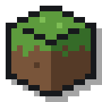
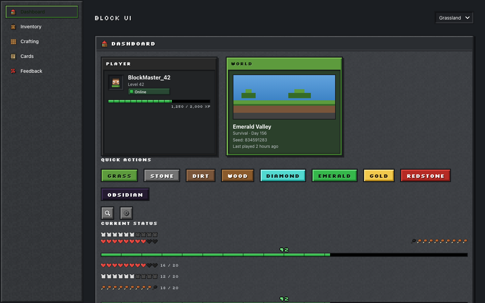
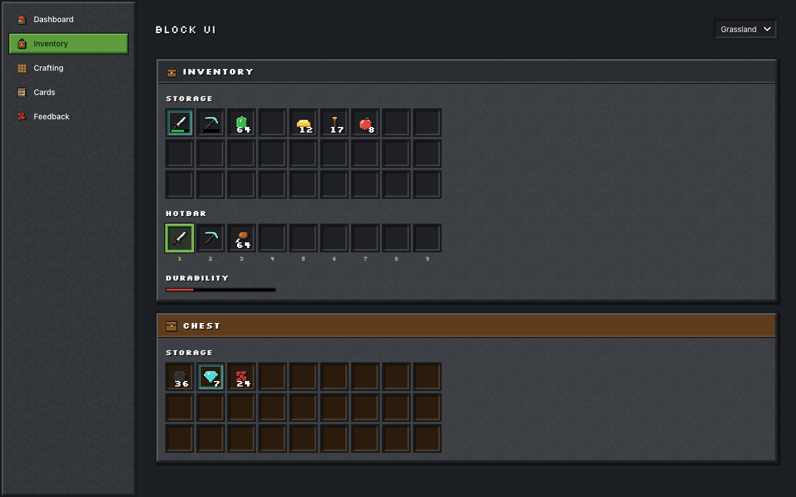
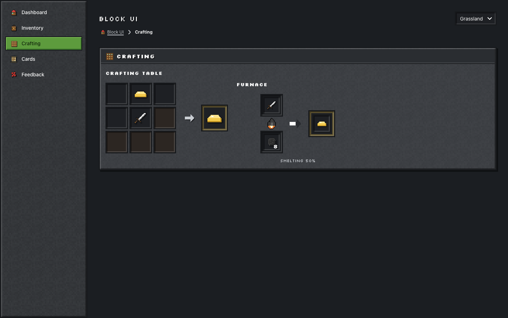
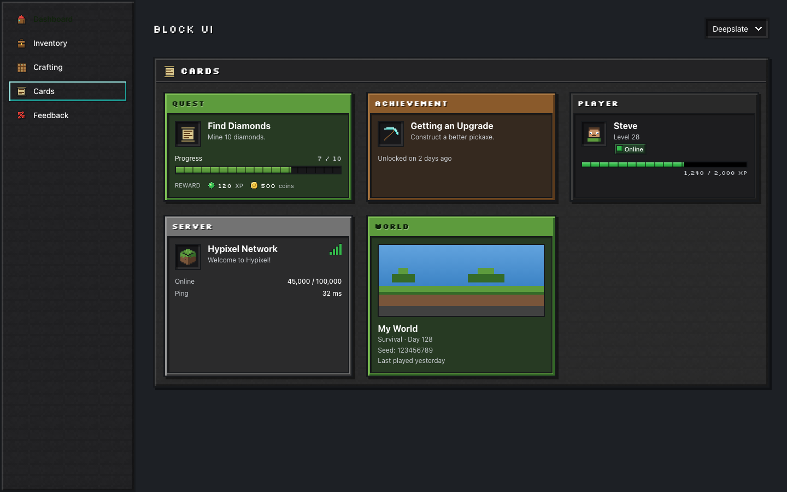
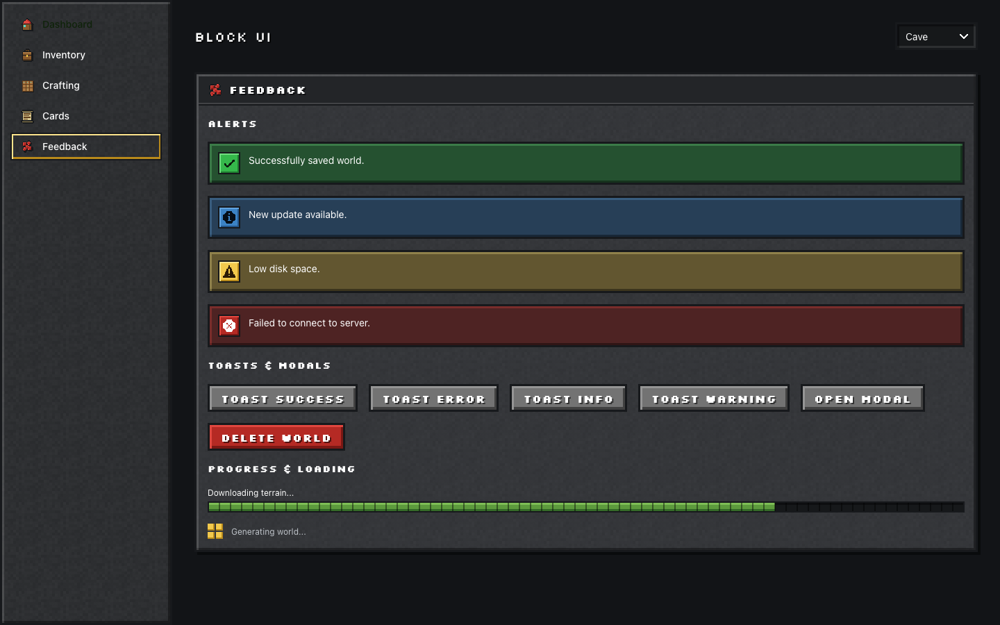
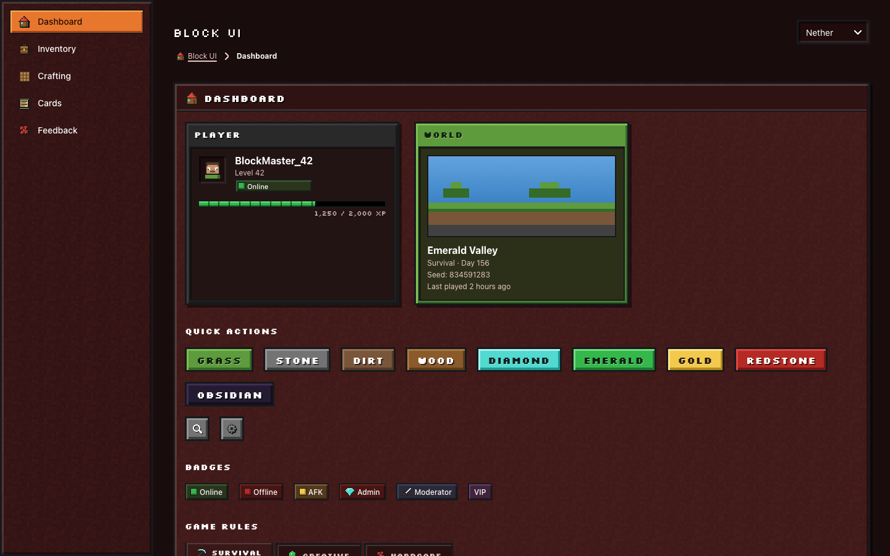
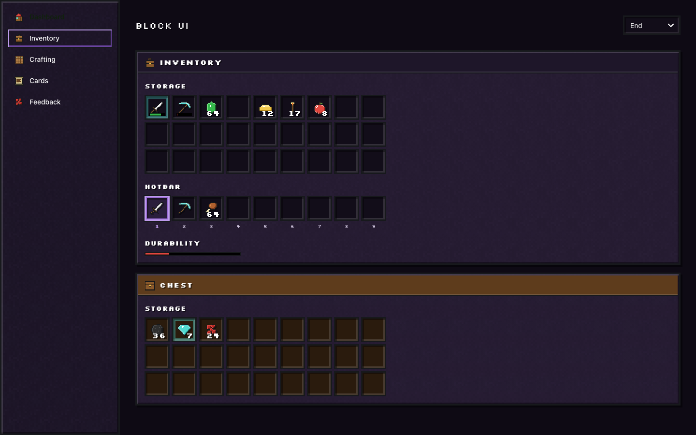
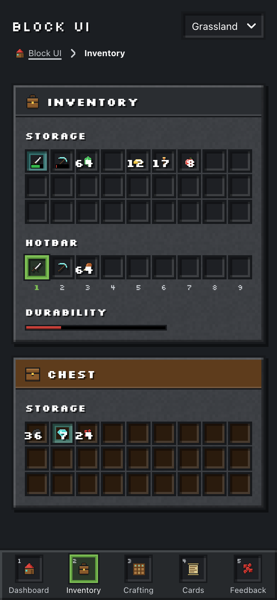

<h1>Block UI</h1>

<p align="right">
  <a href="./README.md">English</a> | 繁體中文
</p>

<p align="center">
  
</p>

<p align="center">方塊 × 像素 × 合成遊戲風格的元件庫，為 React 與 TypeScript 打造</p>

<p align="center">
  <a href="https://github.com/malilion/BlockUI/actions/workflows/ci.yml"></a>
  <a href="https://github.com/malilion/BlockUI/actions/workflows/docs.yml"></a>
  <a href="https://github.com/malilion/BlockUI/stargazers"></a>
  <a href="https://www.npmjs.com/package/@malilion/block-ui-react"></a>
  <a href="./LICENSE"></a>
  <br/>
  
  
  
  
</p>

<p align="center">
  <a href="https://malilion.github.io/BlockUI/"><b>📖 文件與線上範例（Storybook）</b></a>
</p>

<p align="center">
  
</p>

Block UI 是一套 React 元件庫，視覺語言來自方塊建造生存遊戲：**方塊（Block）、背包（Inventory）、合成（Craft）、遊戲 HUD 與像素互動（Pixel Interaction）**。它不是「一般 SaaS 後台 + 像素字體」——每個主要互動都是一塊方塊：按鈕是有斜角立體感的方塊，hover 時往上彈、按下時往下壓；背包是真正可以用鍵盤操作的格子；生命值用愛心表示；合成台把格子裡的材料變成成品。

所有美術素材——50 多個像素圖示、程序生成的石頭／泥土／木板材質與風景預覽圖——全部原創，不包含任何第三方遊戲的官方貼圖、Logo 或角色。

## 特色

- 50 多個元件，涵蓋動作、表單、背包、合成、HUD、卡片、回饋、導覽與版面
- 以 TypeScript 嚴格模式撰寫；每個元件都轉發 ref，並接受 `className` 與原生屬性
- 招牌遊戲 UI：`InventoryGrid`、`InventorySlot`、`ItemStack`、`ItemTooltip`、`Hotbar`、`CraftingTable`、`Furnace`、`QuestCard`、`AchievementCard`、`PlayerHUD`
- 5 套主題——**Grassland（草原）**、**Cave（洞穴）**、**Deepslate（深板岩）**、**Nether（地獄）**、**End（終界）**——只要一個 `data-theme` 屬性就能切換，所有元件不需修改
- 設計 Token 同時提供 TypeScript 物件與 CSS 變數（`--block-*`），元件內不寫死任何顏色
- `@malilion/block-ui-icons`：50 多個原創 16 × 16 像素 SVG 圖示，可 tree-shake
- 無障礙：WCAG 2.2 AA——CI 會在五套主題下用 axe 檢查每個 story 與 Playground，ARIA grid／tabs／dialog 模式、焦點鎖定、清楚的焦點框，並支援 `prefers-reduced-motion`
- 俐落的機械感動畫：不超過 160 ms、使用 `steps()` 緩動，不用彈簧、回彈或模糊
- 響應式：平板時側邊欄收合成圖示列，手機時變成底部的 Hotbar 導覽
- ESM、可 tree-shake（`preserveModules`）、單一 CSS 檔，唯一的 peer dependency 是 React

## 安裝

```bash
pnpm add @malilion/block-ui-react
```

```bash
npm install @malilion/block-ui-react
```

```bash
yarn add @malilion/block-ui-react
```

`@malilion/block-ui-react` 會自動安裝 `@malilion/block-ui-tokens`、`@malilion/block-ui-themes` 與 `@malilion/block-ui-icons`。支援 React 18.2 與 19。

> [!NOTE]
> 已發布到 npm：[`@malilion/block-ui-react`](https://www.npmjs.com/package/@malilion/block-ui-react)、[`-tokens`](https://www.npmjs.com/package/@malilion/block-ui-tokens)、[`-themes`](https://www.npmjs.com/package/@malilion/block-ui-themes) 與 [`-icons`](https://www.npmjs.com/package/@malilion/block-ui-icons)。發布流程見 [docs/RELEASING.md](./docs/RELEASING.md)。

## 快速開始

```tsx
// main.tsx
import "@malilion/block-ui-react/styles.css";
import { createRoot } from "react-dom/client";
import { BlockUIProvider } from "@malilion/block-ui-react";
import App from "./App";

createRoot(document.getElementById("root")!).render(
  <BlockUIProvider theme="deepslate">
    <App />
  </BlockUIProvider>,
);
```

```tsx
// App.tsx
import {
  BlockButton,
  InventoryGrid,
  InventorySlot,
  ItemStack,
  QuestCard,
} from "@malilion/block-ui-react";
import { DiamondIcon } from "@malilion/block-ui-icons";

export default function App() {
  return (
    <>
      <InventoryGrid columns={9} rows={3}>
        <InventorySlot>
          <ItemStack icon={<DiamondIcon />} amount={12} maxAmount={64} name="Diamond" />
        </InventorySlot>
      </InventoryGrid>

      <QuestCard
        title="Find Diamonds"
        description="Mine 10 diamonds."
        progress={7}
        max={10}
        xp={120}
        coins={500}
      />

      <BlockButton variant="grass">Start</BlockButton>
    </>
  );
}
```

一律從套件根目錄匯入，不要從內部路徑匯入：

```tsx
import { BlockButton, InventoryGrid } from "@malilion/block-ui-react"; // ✅
```

在任何地方顯示 Toast。`<BlockUIProvider>` 已經幫你放好通知區：

```ts
import { toast } from "@malilion/block-ui-react";

toast.success("World saved.");
toast.info("Update available.");
toast.warning("Low hunger.");
toast.error("Connection failed.", { duration: 0 }); // 不會自動關閉
```

載入像素字體可以得到完整的方塊風格（沒有字體時元件會退回等寬字體）：

```bash
pnpm add @fontsource/silkscreen
```

```ts
import "@fontsource/silkscreen/400.css";
import "@fontsource/silkscreen/700.css";
```

## 畫面展示

| 背包、快捷欄與箱子                                           | 合成台與熔爐                                           |
| ------------------------------------------------------------ | ------------------------------------------------------ |
|            |       |
| **任務、成就、玩家、伺服器與世界卡片**                       | **提示、Toast、對話框與載入**                          |
|                |       |
| **Nether 主題**                                              | **End 主題**                                           |
|  |  |

<p align="center">
  <br>
  <sub>手機版：側邊欄變成底部的快捷欄導覽。</sub>
</p>

每個元件都有 [Storybook](https://malilion.github.io/BlockUI/) stories（也可在本地執行 `pnpm storybook`）——固定包含 `Default`、`Variants`、`States`、`Sizes`、`Disabled`、`Interactive`（互動測試）與 `Responsive`——並有即時控制項、所有 variants 與 states、使用方式、Props 表、無障礙說明與 a11y 檢查。Storybook 另外有 Foundations 頁面（色彩、字體、間距、陰影、主題、圖示）與完整畫面的 Patterns（儀表板、玩家資料、背包畫面、合成畫面、伺服器瀏覽器）。

## 元件

| 分類  | 元件                                                                                                                                |
| ----- | ----------------------------------------------------------------------------------------------------------------------------------- |
| 動作  | `BlockButton` · `IconButton`                                                                                                        |
| 表單  | `BlockInput` · `BlockTextarea` · `BlockSelect` · `BlockCheckbox` · `BlockRadioGroup` / `BlockRadio` · `BlockToggle` · `BlockSlider` |
| 背包  | `Inventory` / `InventorySection` · `InventoryGrid` · `InventorySlot` · `ItemStack` · `ItemTooltip` · `DurabilityBar` · `Hotbar`     |
| 合成  | `CraftingTable` · `CraftingGrid` · `CraftingSlot` · `CraftingResult` · `Furnace`                                                    |
| HUD   | `HealthBar` · `ArmorBar` · `HungerBar` · `XPBar` · `PlayerHUD`                                                                      |
| 卡片  | `BlockCard` · `QuestCard` · `AchievementCard` · `PlayerCard` · `ServerCard` · `WorldCard`                                           |
| 回饋  | `BlockAlert` · `toast()` / `BlockToaster` · `BlockModal` · `ConfirmDialog` · `BlockProgress` · `BlockLoading` · `BlockBadge`        |
| 導覽  | `BlockSidebar` / `SidebarItem` · `BlockTabs` · `Breadcrumb` · `HotbarNavigation`                                                    |
| 版面  | `BlockUIProvider` · `BlockPanel`                                                                                                    |
| Hooks | `useControllableState` · `useFocusTrap` · `useDigitHotkeys` · `useMediaQuery` · `useToasts` · `useBlockUI`                          |

## 元件 Props

每個元件都接受常見屬性（`className`、`aria-*`、`data-*`、事件處理器）並轉發 ref。以下是最常用的幾個 props：

| 元件            | Prop                      | 型別                                                                                                     | 預設值        | 說明                                             |
| --------------- | ------------------------- | -------------------------------------------------------------------------------------------------------- | ------------- | ------------------------------------------------ |
| BlockButton     | variant                   | `'grass' \| 'stone' \| 'dirt' \| 'wood' \| 'diamond' \| 'emerald' \| 'gold' \| 'redstone' \| 'obsidian'` | `'stone'`     | 方塊材質                                         |
| BlockButton     | loading                   | `boolean`                                                                                                | `false`       | 像素載入動畫、`aria-busy`，並阻擋重複點擊        |
| InventoryGrid   | columns / rows            | `number`                                                                                                 | `9` / —       | 格子大小；設定 `rows` 會自動補上空格             |
| InventoryGrid   | selectedIndex             | `number \| null`                                                                                         | —             | 受控選取，搭配 `onSelectedIndexChange`           |
| InventorySlot   | rarity                    | `'common' \| 'uncommon' \| 'rare' \| 'epic' \| 'legendary'`                                              | —             | 稀有度光暈                                       |
| InventorySlot   | tooltip                   | `ReactNode`                                                                                              | —             | 滑鼠移入**與**鍵盤聚焦時顯示，按 `Escape` 關閉   |
| ItemStack       | icon / amount / maxAmount | `ReactNode` / `number` / `number`                                                                        | —             | 數量顯示在右下角；滿疊時會標示                   |
| Hotbar          | hotkeys                   | `boolean`                                                                                                | `true`        | 數字鍵 `1`–`9` 選擇格子（輸入文字時不會觸發）    |
| CraftingGrid    | size                      | `2 \| 3`                                                                                                 | `3`           | 2 × 2 或 3 × 3                                   |
| Furnace         | progress / burning        | `number` / `boolean`                                                                                     | `0` / `false` | 自動推導狀態：閒置、燃燒、處理中、完成、沒有燃料 |
| HealthBar       | value / max               | `number`                                                                                                 | — / `20`      | 每顆愛心代表 2 點，支援半顆                      |
| BlockProgress   | variant                   | `'grass' \| 'water' \| 'diamond' \| 'emerald' \| 'gold' \| 'redstone'`                                   | `'grass'`     | 不給 `value` 時為不確定進度                      |
| BlockUIProvider | theme                     | `'grassland' \| 'cave' \| 'deepslate' \| 'nether' \| 'end'`                                              | `'grassland'` | 對子樹套用 `data-theme`                          |

完整的 API 表格在 Storybook 中自動產生。型別也一併匯出：

```ts
import type {
  BlockButtonVariant,
  ItemRarity,
  PlayerStats,
  ToastOptions,
} from "@malilion/block-ui-react";
```

## 鍵盤操作

| 元件                         | 按鍵                                                                                                                         |
| ---------------------------- | ---------------------------------------------------------------------------------------------------------------------------- |
| InventoryGrid / CraftingGrid | `←` `↑` `→` `↓` 移動 · `Home` / `End` 跳到列首／列尾（按住 `Ctrl` 為整個格子）· `Enter` / `Space` 選取 · `Escape` 關閉提示框 |
| Hotbar                       | 在頁面任何地方按 `1`–`9` 選擇格子 · `←` `→` 移動並循環                                                                       |
| BlockModal / ConfirmDialog   | `Tab` / `Shift+Tab` 在對話框內循環 · `Escape` 關閉 · 焦點回到觸發按鈕                                                        |
| BlockTabs                    | `←` `→` 移動並啟用（循環）· `Home` / `End`                                                                                   |
| Toast                        | `Escape` 關閉目前聚焦的通知；滑鼠移入或聚焦時暫停自動關閉                                                                    |

## 主題

把整個 App（或其中一區）包在 `BlockUIProvider` 裡。對話框與 Toast 等浮層會渲染在 Provider 內，所以會跟著主題變化。

```tsx
<BlockUIProvider theme="nether">
  <App />
</BlockUIProvider>
```

不使用 Provider？在任何祖先元素上設定 `data-theme`：

```html
<body data-theme="deepslate" class="block-ui-root">
  …
</body>
```

| 主題        | 表面     | 主色   | 氛圍                 |
| ----------- | -------- | ------ | -------------------- |
| `grassland` | 石頭灰   | 草地綠 | 預設，白天的生存世界 |
| `cave`      | 深色石頭 | 火把金 | 地底                 |
| `deepslate` | 深板岩黑 | 鑽石青 | 深邃冷調             |
| `nether`    | 地獄岩紅 | 岩漿橘 | 炙熱                 |
| `end`       | 黑曜石紫 | 紫水晶 | 異世界               |

每套主題都以 `--block-*` CSS 變數定義 `BlockTheme` 的角色（`background`、`surface`、`surfaceAlt`、`primary`、`secondary`、`border`、`text`、`textMuted`……）。測試會檢查每套主題每個表面上的文字都達到 WCAG AA。

## 色票

| 名稱             | Token               | 值        | 用途               |
| ---------------- | ------------------- | --------- | ------------------ |
| 草地 Grass       | `--block-grass`     | `#5d9b3d` | 主色、成功按鈕     |
| 泥土 Dirt        | `--block-dirt`      | `#79553a` | 次要方塊           |
| 木頭 Wood        | `--block-wood`      | `#8a5a2b` | 箱子、卡片         |
| 石頭 Stone       | `--block-stone`     | `#737373` | 預設按鈕、面板     |
| 深板岩 Deepslate | `--block-deepslate` | `#292929` | 深色表面           |
| 鑽石 Diamond     | `--block-diamond`   | `#52d9d0` | 稀有物品、強調     |
| 綠寶石 Emerald   | `--block-emerald`   | `#35b84b` | 成功、經驗值       |
| 黃金 Gold        | `--block-gold`      | `#f2c94c` | 警告、獎勵、焦點框 |
| 紅石 Redstone    | `--block-redstone`  | `#b52a24` | 危險、錯誤         |
| 黑曜石 Obsidian  | `--block-obsidian`  | `#251b31` | End 主題、特殊動作 |

每種材質另有 `-light`、`-dark`，以及保證達到 4.5:1 對比的文字色 `--block-on-*`。元件透過 `data-material="…"` 選擇材質，並讀取 `--block-mat`、`--block-mat-light`、`--block-mat-dark` 與 `--block-mat-on`。

只需要 Token？

```ts
import "@malilion/block-ui-tokens/tokens.css";
import { colors, spacing, motion } from "@malilion/block-ui-tokens";
```

## 設計原則

Block UI 遵守五條規則，新增元件時請一併遵守。

1. **方塊優先**：以正方形、長方形、方塊與格子為基礎。不用膠囊形、大圓角卡片、毛玻璃或模糊的浮動陰影——圓角永遠不超過 6 px。
2. **像素斜角**：表面使用 3 px 外框，左上亮、右下暗的斜角；陰影是硬邊的像素位移，絕不模糊。
3. **機械感動畫**：`snap`、`step`、`pixel`——80／120／160 ms、`steps()` 緩動、小幅位移。不用彈簧、回彈、大幅縮放或模糊動畫。
4. **只用 Token**：元件只使用 `var(--block-*)`；寫死的顏色只存在於 tokens 與 themes 套件。
5. **功能優先於裝飾**：可讀性、對比、鍵盤操作、螢幕閱讀器與響應式版面永遠優先，遊戲感不能成為省略它們的理由。

## 套件

| 套件                        | 說明                                      |
| --------------------------- | ----------------------------------------- |
| `@malilion/block-ui-react`  | React 元件、hooks 與 `styles.css`         |
| `@malilion/block-ui-tokens` | 設計 Token（TypeScript 與 `tokens.css`）  |
| `@malilion/block-ui-themes` | 五套主題（TypeScript 與 `themes.css`）    |
| `@malilion/block-ui-icons`  | 50 多個像素風 React 圖示（16／24／32 px） |

## 本地開發

```bash
git clone https://github.com/malilion/BlockUI.git
cd BlockUI
pnpm install
```

需要 Node.js 22.13 以上與 pnpm 11。

常用指令：

```bash
pnpm dev               # Playground 展示頁 http://localhost:5173
pnpm storybook         # Storybook http://localhost:6006
pnpm test              # Vitest 單元、元件與 axe 測試
pnpm test:e2e          # Playwright E2E（桌機 + 手機）
pnpm lint              # ESLint
pnpm typecheck         # TypeScript 型別檢查
pnpm build             # 建置所有套件與 Playground
pnpm build-storybook   # 建置靜態 Storybook
pnpm check:treeshake   # 確認未使用的元件會被移除
pnpm check:a11y        # 執行每個 story 的 play 互動測試與 axe（WCAG 2.2 AA），需先 build-storybook
pnpm check:package     # 打包後用 npm 安裝到全新 React App，並型別檢查與建置
pnpm check:publish     # 對每個套件做 `pnpm publish --dry-run`（不會上傳）
pnpm screenshots       # 重新產生 README 圖片（需先 pnpm build）
```

```text
block-ui/
├─ apps/
│  ├─ docs/          # Storybook：Introduction、Foundations、Patterns
│  └─ playground/    # 展示用儀表板
├─ packages/
│  ├─ react/         # @malilion/block-ui-react
│  ├─ icons/         # @malilion/block-ui-icons
│  ├─ themes/        # @malilion/block-ui-themes
│  └─ tokens/        # @malilion/block-ui-tokens
├─ tests/e2e/        # Playwright 測試
└─ docs/images/      # README 圖片
```

每個元件都有獨立資料夾，包含 `Component.tsx`、`Component.types.ts`、`Component.module.css`、`Component.test.tsx`、`Component.stories.tsx` 與 `index.ts`。

函式庫使用 Vite library mode 建置成 ESM（`preserveModules`）、TypeScript 型別宣告與單一 `dist/styles.css`。React 為 external，不會被打包。

每次 push 或對 `main` 開 Pull Request 都會執行 GitHub Actions：格式檢查、lint、型別檢查、單元測試、建置、tree-shake 檢查、套件安裝檢查、Storybook 建置、在五套主題下執行每個 story 的互動測試與 axe 檢查，以及 Playwright E2E（含 Playground 的 axe 檢查）。push 到 `main` 時也會把 Storybook 部署到 GitHub Pages。推送 `v*` tag 會把 `@malilion/block-ui-*` 發布到 npm（見 [docs/RELEASING.md](./docs/RELEASING.md)）。

## 瀏覽器支援

Block UI 支援 Chrome、Edge、Firefox 與 Safari 的最近兩個主要版本，使用現代 CSS（`color-mix()`、`:has()`、`clip-path`、`aspect-ratio`、`dvh`）。元件可安全用於 SSR：瀏覽器 API 只在 effect 與事件處理器中使用。

## 授權

MIT License，詳見 [LICENSE](./LICENSE)。

像素圖示、材質與插圖皆為原創，可隨函式庫自由使用。Block UI 與 Mojang 或 Microsoft 無任何關聯。
